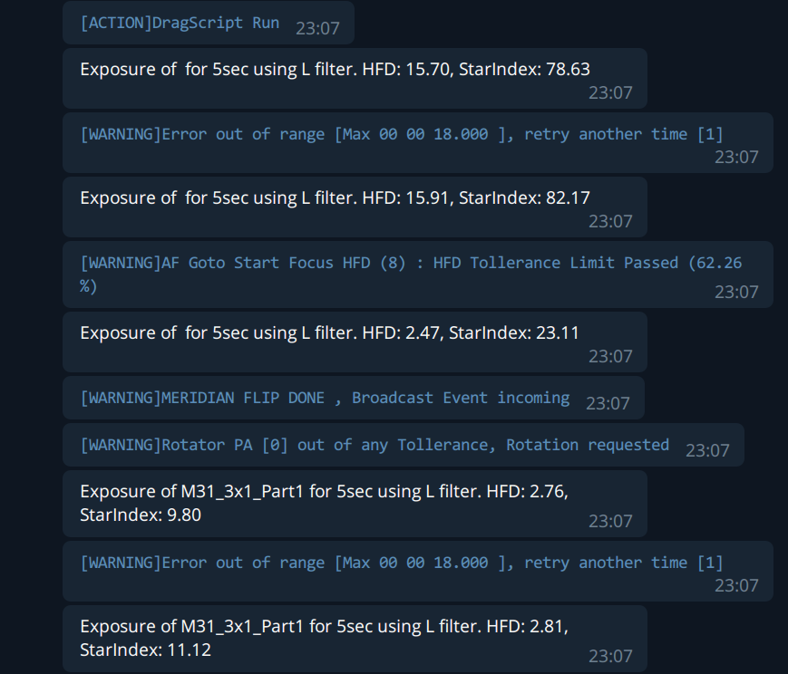

# VoyagerTelegramBot
by Liuyi Sun ([AstroBin](https://www.astrobin.com/users/liuyisun/)) and Kun Wang ([AstroBin](https://www.astrobin.com/users/bigpizza/))

Last updates: 11/13/2021

## Introduction
**VoyagerTelegramBot** is a lightweight client of Voyager Application Server.
Unlike the official [Web Dashboard](https://www.starkeeper.it/wdashinfo/),
**VoyagerTelegramBot** focuses on generating statistical charts and forwarding necessary messages
to [Telegram](https://telegram.org/).

With **VoyagerTelegramBot**, you don't need to keep a dashboard open to monitor the imaging session
for sub-images, system status, and critical warning and errors.  

## Features
- Configurable for types of images and messages
- Critical message forwarding


- Imaging session statistics per sequence


## Installation
To deploy / use the **VoyagerTelegramBot** on your system, there are some basic requirements:

For the computer running Voyager application
- Voyager itself has been installed and configured.
- All necessary drivers and software packages are installed and configured.
- The application server is enabled on your Voyager.

For the computer running **VoyagerTelegramBot**
- python 3.7 or higher environments
- Able to connect to your Voyager Application Server
- Can be and can be not the same computer running Voyager application.

Currently, we only provide a general installation steps which may require some *geek* skills.
1. Prepare your stuffs
   1. Install python 3.7 or later environments;
   2. (*Optional*) Register for a Telegram account and install the app on your phone / tablet / computer ([check here](https://telegram.org/));
   3. Create a new Telegram bot and chat with your Telegram account;
   
      We are trying to write a guide, but before it's done, a quick guide can be found
      [here](https://forum.starkeeper.it/t/send-free-custom-telephone-notifications-to-your-telegram-from-voyager/1889),
      under `Send Telegram` part.
      > **KEEP YOUR BOT TOKEN SECURE**
2. Install package dependence for **VoyagerTelegramBot**;
   
   ```Shell
   pip install -r requirements.txt
   ```
3. Duplicate "config.yml.example" and rename it to "config.xml".
For more information, please refer to [Configuration](https://github.com/sly9/VoyagerTelegramBot#configurations) session;
4. Launch the bot

   ```Shell
   python bot.py
   ```

In the future, we will also add other methods such as Docker, and py2exe.
## Configurations
The default and personalized configuration file () are both plain text,
you can open and edit it with any text editor (notepad, sublimetext, notepad++, just named a few).

Details of each configuration items are explained below
```YAML
version: 0.2
```
Just the version number of our **VoyagerTelegramBot**, no need to touch it.
```YAML
exposure_limit: 30
```
If the exposure time of an image is less than `exposure_limit`,
the image and corresponding messages are ignored, we use it to eliminate images for focusing.
```YAML
ignored_events: [ Polling, VikingManaged, RemoteActionResult, Signal, NewFITReady ]
```
Certain types of messages we received from Voyager application server are ignored.
```YAML
sequence_stats_config:
  types: [ HFDPlot, ExposurePlot, GuidePlot ]  # Select chart types of stats
  filter_styles:
    Ha:
      marker: +
      color: #E53935
    SII:
      marker: v
      color: #B71C1C
    OIII:
      marker: o
      color: #3F51B5
    L:
      marker: +
      color: #9E9E9E
    R:
      marker: +
      color: #F44336
    G:
      marker: +
      color: #4CAF50
    B:
      marker: +
      color: #2196F3
```
Current version supports 3 `types` of charts including
- *HFDPlot* contains HFD and StarIndex values
- *ExposurePlot* summarizes total exposure time per channel / filter
- *GuidePlot* plots all guiding errors as well as some basic statistics

Remove any of them if you don't want to receive the results.

The `filter_styles` defines the colors in chart for each type of filters, you could leave them as default.
```YAML
send_image_msgs: 1  # Send jpeg images to chats
```
If `send_image_msgs` is set to `0`, previews of images will not be included in messages.
But the charts will not be affected.
```YAML
should_dump_log: True
```
It's a setting for debug. If `True`, all messages received will be saved in a log file.
```YAML
voyager_setting:
  domain: <voyager_url>  # Domain or IP for remote Voyager Server
  port: <voyager_port>  # port of remote Voyager Server
  username: <user_name>
  password: <password>
```
Information of the Voyager application server
```YAML
telegram_setting:
  bot_token: <telegram_token>
  chat_ids: [ <chat_id_0>, <chat_id_1> ]  # Comma separated list of telegram chat ids
```
`bot_token` can be found when creating new bot, and `chat_ids` is a list of `chat_id` where the messages will be sent to.
```YAML
timezone: America/Denver
debugging: False
allow_auto_reconnect: True
```
`timezone` is defined with location of your telescope. Eligible values are available [here](https://en.wikipedia.org/wiki/List_of_tz_database_time_zones).
